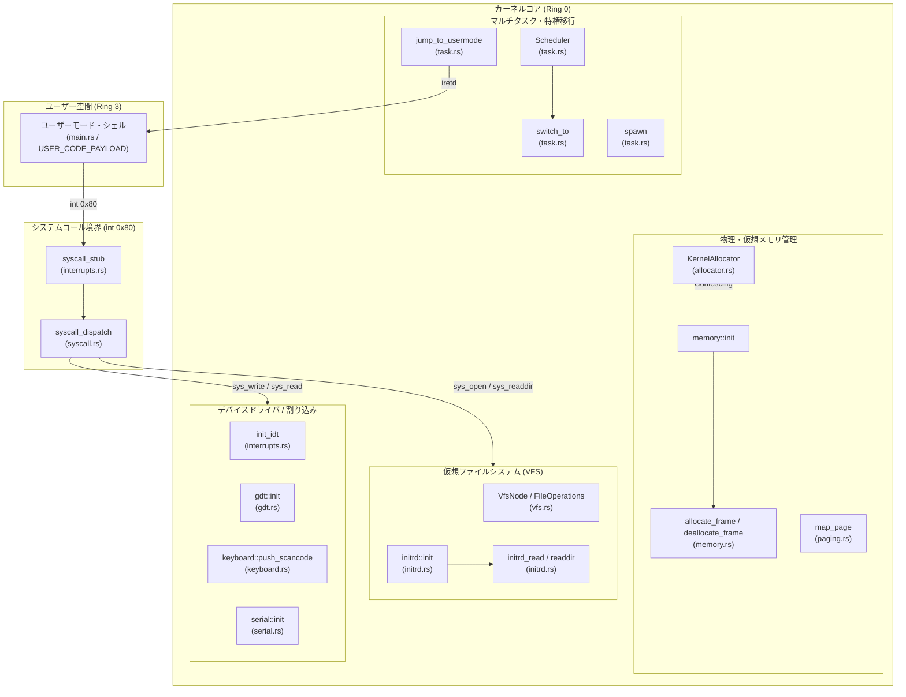

# demo-kernel

## 概要
i686（32bit）カーネルデモ

## 実行方法
1. qemu-system-x86導入
2. rustup component add rust-src
3. 初期ramとしてinitrd.tarを作成
4. cargo run -Zjson-target-spec -Zbuild-std=core,alloc

## 全体章立て
* 第1章: シリアルログ基盤の構築 
* 第2章: CPU基礎の確立 (GDTとTSS)
* 第3章: 割り込み（IDT）と基本的ハードウェア制御（タイマー・キーボード）
* 第4章: 物理・仮想メモリ管理 (2段階ページングの固定化*
* 第5章: カーネルヒープ（動的メモリ割り当て）の解放
* 第6章: カーネルスレッドとスケジューラ（マルチタスクへ）
* 第7章: ユーザーモード（Ring 3）への移行とメモリ孤立
* 第8章: システムコールインフラ（int 0x80）の敷設
* 第9章: 仮想ファイルシステム（VFS）と初期RAMディスク（initrd）
* 第10章: ユーザー空間での自作シェルの動作

## 機能マッピング
各ファイル、主要関数、およびそれらが担う機能のレイヤ構造

| レイヤ | ファイルパス | 主要関数 / 構造体 | 担当機能・役割 |
| --- | --- | --- | --- |
| **エントリー** | `src/main.rs` | `kernel_main` | 各種サブシステムの初期化、ユーザー空間（シェル）への移行トリガー。 |
| **システムコール** | `src/syscall.rs` | `syscall_dispatch``sys_write``sys_read``sys_open``sys_readdir``sys_exit` | ユーザー空間からの要求の検証（厳格なバウンズチェック）と、カーネル機能への安全なディスパッチ。 |
| **マルチタスク** | `src/task.rs` | `switch_to``yield_task``spawn``jump_to_usermode` | 32bit x86レジスタのスタック退避・復元、スレッド生成、`iretd`を用いたRing 3への特権レベル移行。 |
| **メモリ管理** | `src/memory.rs` | `MemoryFrameAllocator``allocate_frame` | Multiboot情報から利用可能メモリを解析し、4KB単位の物理フレームをビットマップで管理・保護。 |
|  | `src/paging.rs` | `map_page` | 32bit 2段階ページングの構築。Present/Writableに加え、`USER_ACCESSIBLE`ビットの動的伝播。 |
|  | `src/allocator.rs` | `KernelAllocator``alloc` / `dealloc` | `GlobalAlloc` の実装。アドレスソート挿入による**空きメモリ領域の自動結合（Coalescing）**アロケータ。 |
| **ファイルシステム** | `src/vfs.rs` | `VfsNode``FileOperations` | ファイルやディレクトリ操作を抽象化。FD（ファイル記述子）とシークオフセットの個別管理。 |
|  | `src/initrd.rs` | `TarHeader``initrd_read``initrd_readdir` | メモリ上のUSTAR（tar）アーカイブをパースし、ヒープ消費ゼロでバッファに展開・マウント。 |
| **ハードウェア/IO** | `src/interrupts.rs` | `init_idt``syscall_stub``page_fault_handler` | 割り込み記述子テーブルの構築。`int 0x80` のDPL=3（トラップゲート）設定、例外ハンドラ。 |
|  | `src/gdt.rs` | `init``set_tss_stack` | グローバル記述子テーブルの構築と特権移行用TSS（タスク状態セグメント）のカーネルスタック（`esp0`）制御。 |
|  | `src/keyboard.rs` | `push_scancode``pop_char` | キーボード入力の一時蓄積リングバッファ。 |
|  | `src/serial.rs` | `init``write_serial``read_serial` | UART 16550を介したホストとの通信。`-nographic` 時のCOM1シリアル入力ポーリング対応。 |
|  | `src/port.rs` | `Port` | インラインアセンブリによる `inb` / `outb` 命令のラッパー。 |

